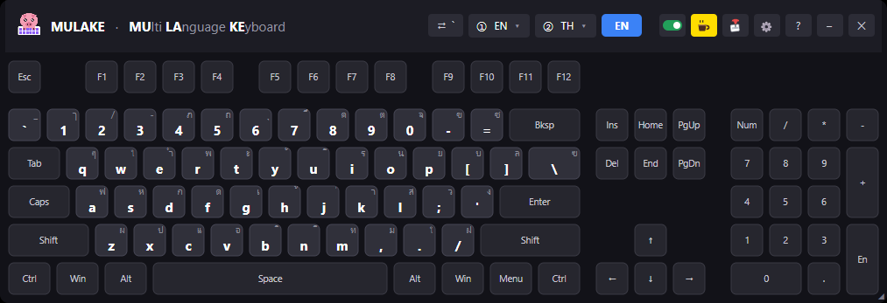
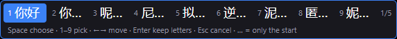
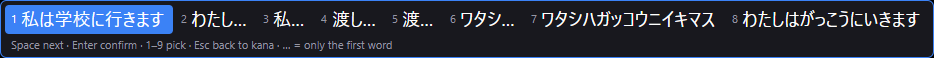
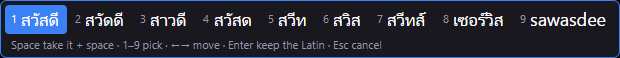
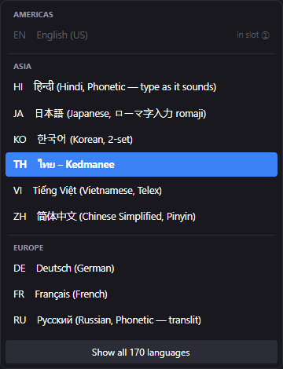
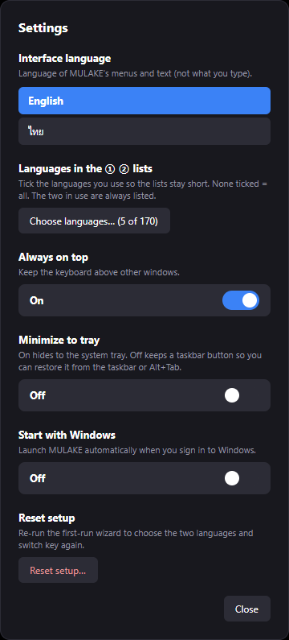

# MULAKE — Multi Language Keyboard

**Type in any language into any Windows app — 170 keyboard layouts and input
methods, nothing to install, and your Windows language settings stay untouched.**

 

MULAKE is a free, portable on-screen keyboard and input method for Windows 10/11.
Pick two languages, press one key to flip between them, and type: the characters go
straight into Notepad, Chrome, Word, LINE — whatever has focus. It is made for typing
your language on a PC that isn't yours (a hotel, an office abroad, a school lab), and
for typing a language you don't have a keyboard for.

### [⬇ Download the latest MULAKE.exe](https://github.com/nasrudinz/MULAKE-releases/releases/latest)

- **Free** — for personal, school and business use; share it with anyone
- **Portable** — one `.exe`, no installer, no administrator rights, runs from a USB stick
- **Leaves Windows alone** — never adds a keyboard or changes a setting; close it and
  the PC is exactly as before
- **Private** — works offline; nothing you type is logged, stored or sent anywhere
- **Any two languages** — not English-locked: German ↔ Thai, Japanese ↔ Korean, …
- **Input methods built in** — Chinese, Japanese, Korean, Vietnamese, and 20
  languages typed as they sound (namaste → नमस्ते, privet → привет, sawasdee → สวัสดี)
- **Interface in English and ไทย**, with an illustrated User Guide and FAQ inside the app

## Why MULAKE?

It started on a trip abroad. I was borrowing someone else's computer and just wanted
to type in Thai. Normally you'd add a Thai keyboard in Windows, right? But on someone
else's PC, it's not that simple:

- Often you're not an admin, so you can't install anything.
- Even when you can, it feels a bit rude to mess with their settings.
- And when you're done, you have to remember to undo it all.

So I thought: what if there were an app you could just double-click and start typing
your own language? No install, no admin, no settings touched, and when you close it the
PC is exactly as it was. That's MULAKE.

At first it was just for Thai. Then it hit me that plenty of people run into the same
problem, not only Thais, so I kept adding languages. Now there's Chinese, Japanese,
Korean, Hindi, Arabic and a lot more. Keep it on a USB stick and you can type your
language on any PC you sit down at.

P.S. "MULAKE" sounds like the Thai for "little pig" (หมูเล็ก), which is how we ended up
with a pig for a mascot 🐷

## Get started

1. Download `MULAKE.exe` from the [latest release](https://github.com/nasrudinz/MULAKE-releases/releases/latest)
   (64-bit, about 69 MB — everything is inside, nothing else to install).
2. Run it. The file isn't code-signed yet, so Windows SmartScreen may ask first:
   **More info → Run anyway**.
3. The Welcome window asks for **Language 1**, **Language 2** and the **switch key**
   (default: the `` ` `` key, top-left).
4. Click into the app you want to type in, press the switch key, and type.

Every button, input method and setting is explained in **About (?) → 📖 User Guide**
inside the app. To update, **About → 🔄 Check for updates** opens this page; replace
the old `MULAKE.exe` with the new one and your settings are kept.

## Input methods

Languages that don't map one key to one character are typed through a small list of
choices under your text cursor. Space takes the first choice, 1–9 pick, Enter keeps
what you typed, Esc cancels — and the list always shows its keys.

| Language | Methods | Example |
|---|---|---|
| Chinese | Pinyin (Simplified 简体, Traditional 繁體), Zhuyin / Bopomofo (Taiwan), Cangjie (Hong Kong) | `nihao` → 你好, `jintiantianqihenhao` → 今天天气很好 |
| Cantonese | Jyutping | `neihou` → 你好, `mgoi` → 唔該 |
| Japanese | Romaji or JIS kana, with kana–kanji conversion | `watashihagakkouniikimasu` → 私は学校に行きます |
| Korean | 2-set (두벌식) and 3-set 390 (세벌식) | ㅎㅏㄴㄱㅡㄹ → 한글 |
| Vietnamese | Telex and VNI | `tieengs Vieejt` / `tie61ng Vie65t` → tiếng Việt |
| South Asian (Phonetic) | Hindi, Marathi, Bengali, Punjabi, Gujarati, Tamil, Telugu, Kannada, Malayalam, Sinhala, Urdu, Sindhi | `namaste` → नमस्ते, `vanakkam` → வணக்கம் |
| Cyrillic, Greek (Phonetic) | Russian, Ukrainian, Greek | `privet` → привет, `kalimera` → καλημέρα |
| Arabic script (Phonetic) | Arabic, Persian (Arabizi: 3 = ع, 7 = ح) | `marhaba` → مرحبا, `7abibi` → حبيبي |
| Thai (Phonetic) | any common spelling of the sound | `sawasdee` / `sawatdee` → สวัสดี |
| Ethiopic (Phonetic) | Amharic, Tigrinya | `selam` → ሰላም |

 
 

All dictionaries are built into the exe and nothing is looked up online. MULAKE never
stores what you type, so it doesn't learn new words.

## Keyboard layouts

Besides the input methods, MULAKE has the keyboard layouts of Windows itself — Thai
Kedmanee and Pattachote, Lao, Arabic, Hebrew, Russian, Greek, Georgian, Armenian, the
European layouts, Indic, African and many more — including Shift, AltGr and dead keys,
so each one types exactly what the same Windows layout would. The pickers are grouped
by continent, and **Settings → Languages in the ① ② lists** keeps them to the ones
you use. Need the plain keyboard for a moment? Click the green switch in the header to
pause MULAKE.

&nbsp;&nbsp;

You can also add your own layout as a small `.json` file — see **User Guide → Add
your own language**.

## Privacy

MULAKE runs entirely on your PC. It does not log, store or remember what you type,
never connects to the internet (the feedback, coffee and update buttons only open
your own email program or browser), and never changes your Windows language or
keyboard settings.

## Good to know

- Apps running **as administrator**, the **sign-in / UAC screens** and some **games**
  don't accept typing from normal apps — that's Windows' own protection. Pause MULAKE
  there.
- **Chinese in Windows 11 Notepad** may show as boxes (Notepad picks the font from
  your Windows keyboard language). Choose a Chinese font in Notepad, e.g. Microsoft
  YaHei; other apps are fine.
- More answers: **About → Help & FAQ** inside the app.

## License

MULAKE is **freeware** — free to use for personal, school and business purposes, and
free to share as long as you share the original files unmodified and don't charge
for them. It is not open source. See [LICENSE.txt](LICENSE.txt)
([ภาษาไทย](LICENSE.th.txt)). MULAKE includes open-source software and open data;
their licences are in [THIRD-PARTY-NOTICES.txt](THIRD-PARTY-NOTICES.txt).

## Feedback and support

Found a bug or have an idea? Use **About → ✉ Send feedback / Report a bug** in the
app, or open an [issue](https://github.com/nasrudinz/MULAKE-releases/issues).

MULAKE is free. If it helps you, ☕ [buy me a coffee](https://www.buymeacoffee.com/nasrudinz).

---

## ภาษาไทย

**MULAKE พิมพ์ภาษาต่าง ๆ เข้าแอปไหนก็ได้บน Windows — 170 เลย์เอาต์และระบบป้อนข้อความ
ไม่ต้องติดตั้ง และไม่แตะการตั้งค่าภาษาของเครื่อง**

### [⬇ ดาวน์โหลด MULAKE.exe เวอร์ชันล่าสุด](https://github.com/nasrudinz/MULAKE-releases/releases/latest)

- **ใช้ฟรี** ทั้งส่วนตัว โรงเรียน และที่ทำงาน ส่งต่อให้คนอื่นได้
- ไฟล์ `.exe` ไฟล์เดียว ไม่ต้องติดตั้ง ไม่ต้องใช้สิทธิ์ admin รันจาก USB ได้
- ไม่เพิ่มคีย์บอร์ดและไม่แก้การตั้งค่า Windows ปิดโปรแกรมแล้วเครื่องเหมือนเดิม
- ทำงานออฟไลน์ ไม่เก็บ ไม่จำ และไม่ส่งสิ่งที่พิมพ์ไปไหน
- เลือกสองภาษาใดก็ได้ แล้วกดปุ่มเดียวสลับไปมา (ค่าเริ่มต้นคือปุ่ม `` ` ``)
- มีระบบป้อนข้อความในตัว: จีน (พินอิน จู้อิน ชางเจี๋ย) กวางตุ้ง ญี่ปุ่น (โรมาจิ คานะ)
  เกาหลี (2 ชุด 3 ชุด) เวียดนาม (Telex VNI) และอีก 20 ภาษาที่พิมพ์ตามเสียง เช่น
  `namaste` → नमस्ते, `privet` → привет, `sawasdee` → สวัสดี
- หน้าจอโปรแกรมเป็นภาษาไทยหรืออังกฤษก็ได้ (ตั้งค่า → ภาษาของโปรแกรม) พร้อมคู่มือ
  การใช้งานแบบมีภาพและ FAQ ในโปรแกรม (ปุ่ม ? → 📖 คู่มือการใช้งาน)

### ทำไมถึงมี MULAKE

เรื่องมันเริ่มจากตอนที่ผมไปต่างประเทศครับ ต้องยืมใช้คอมของคนอื่น แล้วอยากพิมพ์ภาษาไทย
ปกติก็แค่ไปเพิ่มคีย์บอร์ดภาษาไทยใน Windows ใช่ไหมครับ แต่พอเป็นเครื่องคนอื่น มันไม่ง่ายแบบนั้น

- บางเครื่องเราไม่ได้เป็น admin เลยติดตั้งอะไรไม่ได้
- ต่อให้ติดตั้งได้ ก็รู้สึกเกรงใจที่ต้องไปยุ่งกับการตั้งค่าเครื่องของเขา
- แล้วพอใช้เสร็จก็ต้องมานั่งไล่ลบคืนอีก

เลยคิดว่า ถ้ามีโปรแกรมที่ดับเบิลคลิกแล้วพิมพ์ภาษาของเราได้เลย ไม่ต้องติดตั้ง ไม่ต้องขอสิทธิ์
admin ไม่แตะการตั้งค่าอะไรของเครื่อง ปิดแล้วทุกอย่างก็เหมือนเดิม คงจะดีมาก ก็เลยทำ MULAKE ขึ้นมาครับ

ตอนแรกตั้งใจแค่ให้พิมพ์ไทยได้ แต่ทำไปทำมาก็คิดว่า คนที่เจอปัญหาแบบเดียวกันคงไม่ได้มีแค่คนไทย
เลยเพิ่มภาษาอื่นเข้าไปเรื่อย ๆ จนตอนนี้มีทั้งจีน ญี่ปุ่น เกาหลี ฮินดี อาหรับ และอื่น ๆ อีกเยอะ
ใครเอาไปใส่ USB ติดตัวไว้ ไปใช้เครื่องไหนก็พิมพ์ภาษาตัวเองได้

ป.ล. ชื่อ MULAKE อ่านแล้วคล้าย "หมูเล็ก" เลยได้น้องหมูมาเป็นมาสคอตด้วย 🐷

**เริ่มใช้งาน:** ดาวน์โหลด `MULAKE.exe` แล้วเปิดได้เลย ถ้า Windows SmartScreen เตือน
ให้กด **More info → Run anyway** (ไฟล์ยังไม่ได้เซ็นดิจิทัล)
**อัปเดต:** About → 🔄 ตรวจหาเวอร์ชันใหม่ แล้วเอาไฟล์ใหม่มาแทนไฟล์เดิม การตั้งค่ายังอยู่ครบ
**สัญญาอนุญาต:** ฟรีแวร์ — [LICENSE.th.txt](LICENSE.th.txt)

ถ้าชอบโปรแกรม ☕ [เลี้ยงกาแฟ](https://www.buymeacoffee.com/nasrudinz) ได้ครับ
